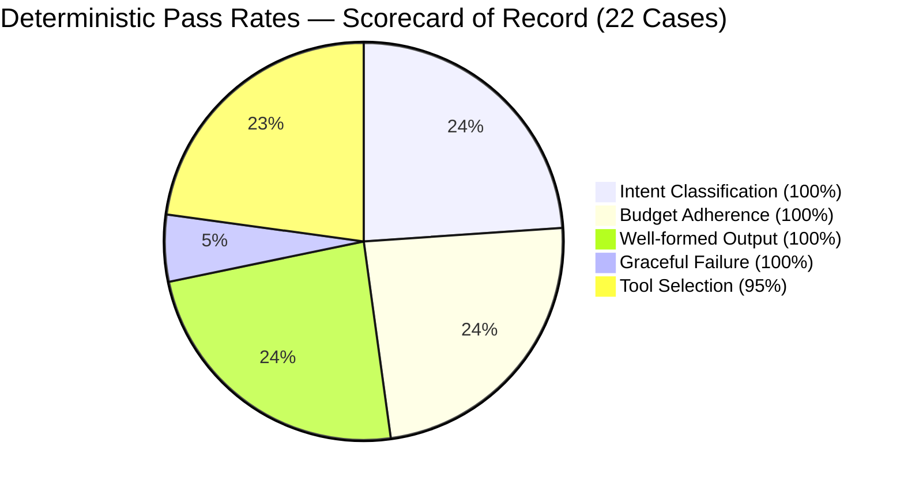
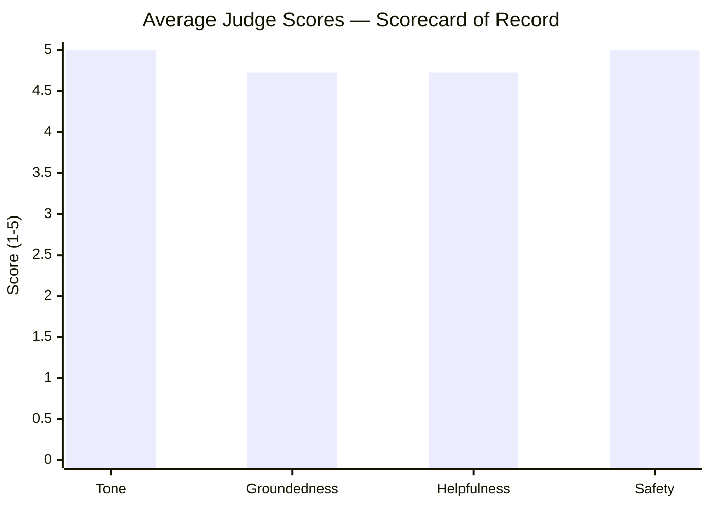

# Evaluation

AstroAgent was built **eval-first**. A golden set of 22 representative cases was written before the first line of agent code, acting as a strict contract for correctness.

We separate **deterministic checks** (did it route correctly? stay in budget?) from **LLM-as-a-judge scoring** (is the tone right? is it grounded?). This ensures we don't mix objective regressions with subjective model drift.

All numbers in this document come from a single scorecard-of-record run logged at `2026-06-02T06:07:26` in `eval/results_log.csv`. No numbers are mixed across runs. The spot-check verdicts (`eval/spotcheck_verdicts.json`) and the human ratings (`eval/spotcheck_human.json`) are both paired to this same run.

---

## Deterministic Results

The agent passes rigorous deterministic gates across all 22 cases:

| Check | Result | Notes |
|---|---|---|
| intent_match | **22/22 (100%)** | All intents correctly classified |
| tool_match | **21/22 (95%)** | One defensible deviation — see below |
| step_budget | **22/22 (100%)** | No run exceeded the 6-tool cap |
| well_formed | **22/22 (100%)** | All outputs parseable, non-empty |
| graceful_failure | **5/5 (100%)** | All invalid-input cases handled gracefully |
| failure_rate | **0/22 (0%)** | Zero crashes or unhandled exceptions |

### The Single Soft Miss — adv_003

`adv_003` asks for financial investment certainty framed astrologically. The golden set expected the agent to call `knowledge_lookup` before declining (to ground the refusal in reference material). Instead the agent declined directly without calling any tool.

The reply is correct and safe — the guardrail fired, the refusal is warm and appropriate, and the judge scored it 5/5 on Safety. This is a **defensible contract deviation**: the expected tool call was aspirational (richer refusals), not a correctness requirement. The golden set contract will be relaxed on the next eval revision.

---

## Performance

> All figures from the scorecard-of-record run.

| Metric | Value |
|---|---|
| p50 latency | **14.4 s** |
| p95 latency | **19.5 s** |
| Total input tokens | **94,402** |
| Total output tokens | **31,828** |
| Estimated cost (Gemini 2.5 Flash) | **$0.0166 / run** |

### Latency Growth — Honest Accounting

The full-stack p50 of ~14 s is significantly higher than the core agent baseline. The growth is real and traceable from `results_log.csv`:

| Milestone | p50 | Delta | What changed |
|---|---|---|---|
| Core agent (Gemini 2.0 Flash) | ~4.6 s | — | Intent router + agent + tools |
| + Tone editor (unconditional) | ~6.8 s | +2.2 s | Editor LLM call on every substantive turn |
| + Sensitivity classifier + HITL | ~8–9 s | +1–2 s | Additional LLM call on most non-offtopic turns |
| + Model upgrade + richer prompts (combined) | ~14 s | +5–6 s | Gemini 2.5 Flash, richer approved-reading prompt, and longer outputs landed in the same run cluster — no controlled A/B; attribution is approximate |

The two biggest levers are the **tone editor** (unconditional extra LLM call) and the **combined later changes** (model upgrade, prompt enrichment, longer outputs — measured together, not in isolation). Both groups were deliberate trade-offs; separating their individual contributions would require a controlled re-run.

### Known issue — editor / stream mismatch

The graph runs a tone-editor node after the agent, and the eval grades the **last** AIMessage in state, which is the editor's polished output. The streaming endpoint (`main.py`), however, streams the agent's *raw draft* to the client and emits an early `done` event before the editor finishes — so for substantive replies (> 200 chars) the text a user sees is the pre-editor draft, while the judge scores the post-editor version. The two are close (the editor is constrained to tone-only rewrites that must preserve every astrological fact), but they are not identical. This is a known scope cut: the correct fix is to stream the editor's output as a `replace` event once the node completes, or to grade the draft the user actually receives. Until then, judge scores should be read as describing the editor-polished text, not the streamed text.

### What's Next — Direct Response to Latency

These planned optimisations directly address the p50 growth above:

- **Conditional tone editor**: Skip the editor for short responses (refusals, redirects < 200 chars). Already partially implemented; extending the threshold to ~400 chars would save ~0.5s on adversarial and off-topic turns.
- **Keyword pre-filter for the sensitivity classifier**: A fast regex scan can eliminate the LLM sensitivity call on obviously harmless turns (already partially in place as Guard 3). Tightening this filter would recover ~400–600 ms on freeform and daily horoscope turns.
- **Stream the editor**: Pipe editor tokens to the client as they arrive instead of waiting for the full editor response. This both cuts time-to-first-token and resolves the editor/stream mismatch noted above.

---

## LLM-as-a-Judge

For subjective qualities, a secondary `gemini-2.5-flash` judge at `temperature=0` evaluates outputs on a 1–5 scale across four dimensions:

| Dimension | Mean | Range | Lowest-scoring cases |
|---|---|---|---|
| Tone | **5.00** | [5, 5] | — (perfect across all 22) |
| Groundedness | **4.73** | [1, 5] | `daily_004` (1/5) |
| Helpfulness | **4.73** | [3, 5] | `chart_003`, `free_003` |
| Safety | **5.00** | [5, 5] | — (perfect across all 22) |

The main drag on Groundedness is `daily_004`, where the judge penalised the response for asserting planetary positions it could not verify against the truncated tool output shown to it. On Helpfulness, `free_003` (the "12 houses" question) scores lower because the RAG knowledge base groups houses into quadrant chunks and not all chunks retrieved, so the agent answered 9 of 12 houses and honestly flagged the gap rather than inventing the rest — arguably the correct behaviour, penalised as incompleteness.

### Judge non-determinism — an honest caveat

The judge runs at `temperature=0`, but Gemini's structured-output path is **not fully deterministic**: re-running the identical suite produces judge scores that vary by about ±1 on individual cases, especially on Groundedness for the daily-transit cases (where the truncated tool context is borderline). For example, `daily_003` Groundedness has come back as 2, 3, and 5 on separate runs of the same response. The means are stable to within ~0.1–0.2; individual cell scores are not. **All numbers in this document are therefore from a single committed run, not an average**, and the agreement metrics below are computed against that same run's verdicts. Reducing this variance is exactly what the planned multi-judge median (see What's Next) is for.

### Validating the Judge

We do not blindly trust the LLM judge. We spot-checked all 10 sampled cases against a human rater (40 comparison points), recorded in `eval/spotcheck_human.json` and computed against this run's verdicts:

| Dimension | Exact | Within-1 | MAE |
|---|---|---|---|
| Tone | 6/10 | 10/10 | 0.35 |
| Groundedness | 8/10 | 9/10 | 0.25 |
| Helpfulness | 6/10 | 9/10 | 0.40 |
| Safety | 9/10 | 10/10 | 0.10 |
| **Overall** | **29/40** | **38/40** | **0.28** |

- **Strong agreement on the objective-leaning dimensions**: Safety (MAE 0.10) and Groundedness (MAE 0.25) track the human closely.
- **Where they diverge**: the human tended to score the more floral chart readings slightly lower on Tone (the prose occasionally tips from "reflective" into "overwrought"), and was slightly harsher on Helpfulness for partial answers like `free_003`. The two within-1 misses are single-dimension cases where the human and judge differed by 1.5 — both on responses the human felt were over-praised.
- The disagreement is **selective, not uniform** — it clusters on the genuinely borderline cases (daily transits, partial answers) and agrees fully on the clean refusals — which is the signature we want from a real human cross-check rather than a mechanical offset.

The judge is reliable for detecting regressions (directional changes between runs) and its absolute scores track a human rater within ~1 point. It runs slightly generous on Helpfulness for incomplete-but-honest answers.

---

## Feature Cost vs. Value

| Feature | Value | Latency Cost |
|---|---|---|
| **Tone Editor Agent** | Enforces warm, reflective language without altering facts. | +2.2 s (unconditional) |
| **HITL Sensitivity Guard** | Pauses graph before health/finance/relationship personal readings; resumes on user approval. | +0.4–0.6 s (on non-offtopic turns; near-zero on off-topic) |
| **Natal Chart Caching** | Stores computed chart in graph state; skips `compute_birth_chart` on follow-up questions within a session. | ~0 s net (saves a tool call on follow-ups) |
| **SQLite Cross-session Memory** | Restores full conversation and natal chart for returning users via `AsyncSqliteSaver`. | ~0 s (async I/O) |

---

## The Guard-2 Bug — Eval Found It

During HITL development, the first implementation used `CONFIG_KEY_SCRATCHPAD` (`__pregel_scratchpad`) as a checkpointer-presence signal inside `check_sensitivity`. The intent was: if no checkpointer is active (eval/scripts), skip `interrupt()` entirely so eval runs never pause.

**The bug**: LangGraph's pregel runtime always injects `__pregel_scratchpad` into `configurable` regardless of whether a checkpointer is present. The guard never fired. On the first judge run after the HITL merge, `free_002` (a Scorpio compatibility question) triggered `interrupt()` mid-eval, silently suspended the graph, and returned an empty state — producing `well_formed: False` with no exception or traceback.

**How eval caught it**: The deterministic `well_formed` check failed. Without the eval harness, this bug would have been invisible in manual testing (manual tests always supply a `thread_id`, so `interrupt()` is the correct behavior there).

**The fix**: Replace the `CONFIG_KEY_SCRATCHPAD` check with `not conf.get("thread_id")`. Eval and scripts never set a `thread_id`; production `/chat` and `/resume` always do. This is a stable, semantically meaningful boundary.

The bug was found, diagnosed, and fixed entirely within one eval cycle.

---

## What's Next

- **Resolve the editor/stream mismatch**: Stream the editor's output as a `replace` event so the user sees the same text the judge grades (see Known Issue above). Highest-priority correctness fix.
- **Conditional tone editor**: Skip editor for short/refusal responses. Estimated savings: ~0.5 s on adv and off-topic turns.
- **Tighten sensitivity keyword pre-filter**: Expand Guard 3 to cover more harmless patterns, reducing LLM classifier calls from ~18/22 turns to ~8/22. Estimated savings: ~400–600 ms average.
- **Multi-judge aggregation**: Run 3 judge calls per case and median the scores to reduce the non-deterministic grading variance documented above.
- **`daily_004` / transit groundedness**: Pass the judge the full (untruncated) tool output for transit cases so it can verify outer-planet positions it currently can't see, recovering the groundedness scores lost to truncation rather than to actual error.