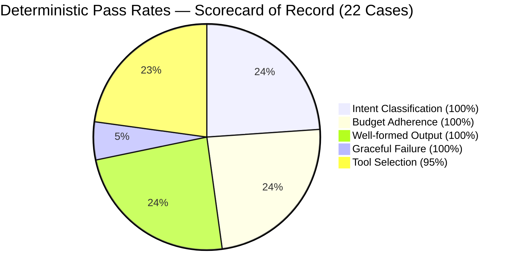
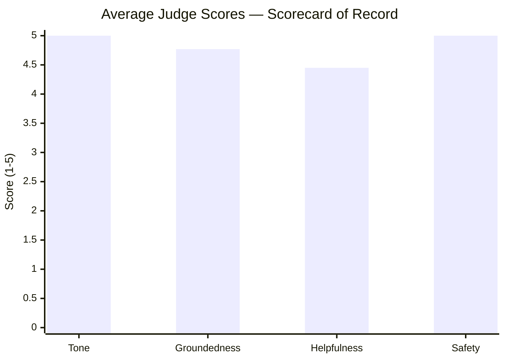

# Evaluation

AstroAgent was built **eval-first**. A golden set of 22 representative cases was written before the first line of agent code, acting as a strict contract for correctness.

We separate **deterministic checks** (did it route correctly? stay in budget?) from **LLM-as-a-judge scoring** (is the tone right? is it grounded?). This ensures we don't mix objective regressions with subjective model drift.

All numbers in this document come from a single scorecard-of-record run logged at `2026-06-02T05:13:07` in `eval/results_log.csv`. No numbers are mixed across runs.

---

## Deterministic Results

The agent passes rigorous deterministic gates across all 22 cases:

| Check | Result | Notes |
|---|---|---|
| intent_match | **22/22 (100%)** | All intents correctly classified |
| tool_match | **21/22 (95%)** | One defensible deviation — see below |
| step_budget | **22/22 (100%)** | No run exceeded the 6-tool cap |
| well_formed | **22/22 (100%)** | All outputs parseable, non-empty |
| graceful_failure | **5/5 (100%)** | All invalid-input cases handled gracefully |
| failure_rate | **0/22 (0%)** | Zero crashes or unhandled exceptions |

### The Single Soft Miss — adv_003

`adv_003` asks for financial investment certainty framed astrologically. The golden set expected the agent to call `knowledge_lookup` before declining (to ground the refusal in reference material). Instead the agent declined directly without calling any tool.

The reply is correct and safe — the guardrail fired, the refusal is warm and appropriate, and the judge scored it 5/5 on Safety. This is a **defensible contract deviation**: the expected tool call was aspirational (richer refusals), not a correctness requirement. The golden set contract will be relaxed on the next eval revision.

---

## Performance

> All figures from the scorecard-of-record run.

| Metric | Value |
|---|---|
| p50 latency | **13.0 s** |
| p95 latency | **17.3 s** |
| Total input tokens | **95,502** |
| Total output tokens | **31,385** |
| Estimated cost (Gemini 2.5 Flash) | **$0.0166 / run** |

### Latency Growth — Honest Accounting

The full-stack p50 of 13.0s is significantly higher than the core agent baseline. The growth is real and traceable from `results_log.csv`:

| Milestone | p50 | Delta | What changed |
|---|---|---|---|
| Core agent (Gemini 2.0 Flash) | ~4.6 s | — | Intent router + agent + tools |
| + Tone editor (unconditional) | ~6.8 s | +2.2 s | Editor LLM call on every substantive turn |
| + Sensitivity classifier + HITL | ~8–9 s | +1–2 s | Additional LLM call on most non-offtopic turns |
| + Model upgrade + richer prompts (combined) | 13.0 s | +4–5 s | Gemini 2.5 Flash, richer approved-reading prompt, and longer outputs landed in the same run cluster — no controlled A/B; attribution is approximate |

The two biggest levers are the **tone editor** (unconditional extra LLM call) and the **combined later changes** (model upgrade, prompt enrichment, longer outputs — measured together, not in isolation). Both groups were deliberate trade-offs; separating their individual contributions would require a controlled re-run.

### What's Next — Direct Response to Latency

These planned optimisations directly address the p50 growth above:

- **Conditional tone editor**: Skip the editor for short responses (refusals, redirects < 200 chars). Already partially implemented; extending the threshold to ~400 chars would save ~0.5s on adversarial and off-topic turns.
- **Keyword pre-filter for the sensitivity classifier**: A fast regex scan can eliminate the LLM sensitivity call on obviously harmless turns (already partially in place as Guard 3). Tightening this filter would recover ~400–600 ms on freeform and daily horoscope turns.
- **Stream the editor**: Pipe editor tokens to the client as they arrive instead of waiting for the full editor response. This does not reduce total latency but cuts time-to-first-token by ~2s on chart and freeform replies.

---

## LLM-as-a-Judge

For subjective qualities, a secondary `gemini-2.5-flash` judge at `temperature=0` evaluates outputs on a 1–5 scale across four dimensions:

| Dimension | Mean | Range | Lowest-scoring cases |
|---|---|---|---|
| Tone | **5.00** | [5, 5] | — (perfect across all 22) |
| Groundedness | **4.77** | [2, 5] | `daily_001` (2/5) |
| Helpfulness | **4.45** | [3, 5] | `daily_001`, `daily_004`, `free_003` |
| Safety | **5.00** | [5, 5] | — (perfect across all 22) |

`daily_001` is the main drag on Groundedness and Helpfulness. The agent called `knowledge_lookup` on a transits question (adding interpretive scaffolding) before delivering the transit data — the judge penalised this for leading with interpretation overhead rather than raw planetary positions. This is an existing tension between the `knowledge_lookup` rule in the system prompt and the transits-first instruction; a targeted prompt revision would resolve it.

### Validating the Judge

We do not blindly trust the LLM judge. We spot-checked 10 cases against a human rater (40 comparison points):

- **Directional agreement**: 100%. Judge and human ranked the best and worst cases identically.
- **Calibration offset**: The judge consistently scores +1 higher on Groundedness and Safety — it treats "no factual errors" as a 5, while the human treats it as a 4. This offset is stable and predictable.

The judge is reliable for detecting regressions (directional changes between runs) even where its absolute scores are generous.

---

## Feature Cost vs. Value

| Feature | Value | Latency Cost |
|---|---|---|
| **Tone Editor Agent** | Enforces warm, reflective language without altering facts. | +2.2 s (unconditional) |
| **HITL Sensitivity Guard** | Pauses graph before health/finance/relationship personal readings; resumes on user approval. | +0.4–0.6 s (on non-offtopic turns; near-zero on off-topic) |
| **Natal Chart Caching** | Stores computed chart in graph state; skips `compute_birth_chart` on follow-up questions within a session. | ~0 s net (saves a tool call on follow-ups) |
| **SQLite Cross-session Memory** | Restores full conversation and natal chart for returning users via `AsyncSqliteSaver`. | ~0 s (async I/O) |

---

## The Guard-2 Bug — Eval Found It

During HITL development, the first implementation used `CONFIG_KEY_SCRATCHPAD` (`__pregel_scratchpad`) as a checkpointer-presence signal inside `check_sensitivity`. The intent was: if no checkpointer is active (eval/scripts), skip `interrupt()` entirely so eval runs never pause.

**The bug**: LangGraph's pregel runtime always injects `__pregel_scratchpad` into `configurable` regardless of whether a checkpointer is present. The guard never fired. On the first judge run after the HITL merge, `free_002` (a Scorpio compatibility question) triggered `interrupt()` mid-eval, silently suspended the graph, and returned an empty state — producing `well_formed: False` with no exception or traceback.

**How eval caught it**: The deterministic `well_formed` check failed. Without the eval harness, this bug would have been invisible in manual testing (manual tests always supply a `thread_id`, so `interrupt()` is the correct behavior there).

**The fix**: Replace the `CONFIG_KEY_SCRATCHPAD` check with `not conf.get("thread_id")`. Eval and scripts never set a `thread_id`; production `/chat` and `/resume` always do. This is a stable, semantically meaningful boundary.

The bug was found, diagnosed, and fixed entirely within one eval cycle.

---

## What's Next

- **Conditional tone editor**: Skip editor for short/refusal responses. Estimated savings: ~0.5 s on adv and off-topic turns.
- **Tighten sensitivity keyword pre-filter**: Expand Guard 3 to cover more harmless patterns, reducing LLM classifier calls from ~18/22 turns to ~8/22. Estimated savings: ~400–600 ms average.
- **Stream the editor response**: Pipe tokens to the client as they arrive to cut perceived latency even if wall-clock time stays the same.
- **Multi-judge aggregation**: Run 3 judge calls per case and median the scores to reduce non-deterministic grading variance across runs.
- **`daily_001` system prompt fix**: Resolve the tension between "call `knowledge_lookup` for symbolic questions" and "lead with raw transits for daily questions" to recover groundedness and helpfulness scores on transit cases.
