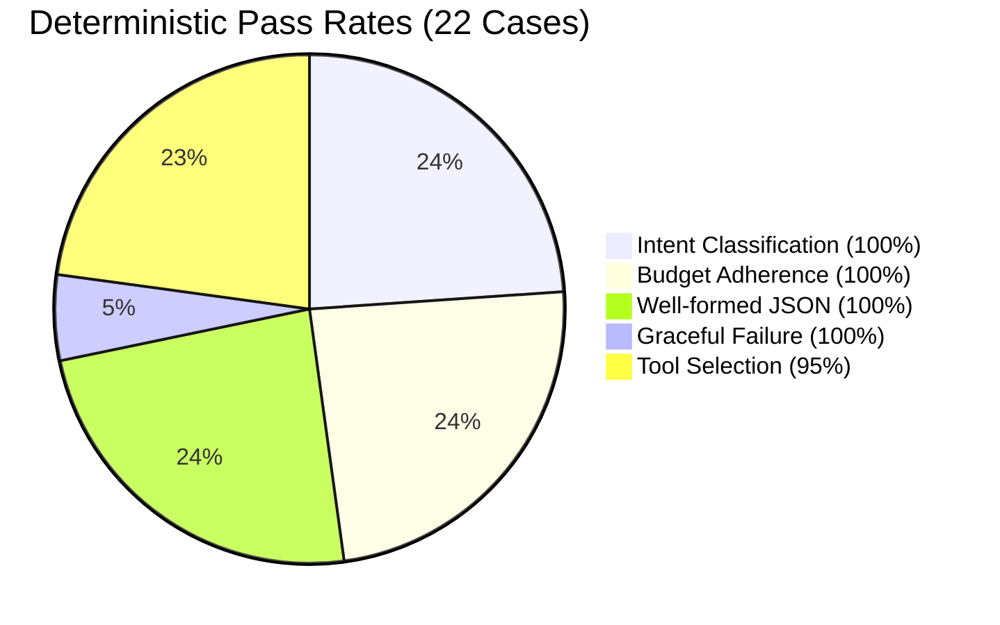
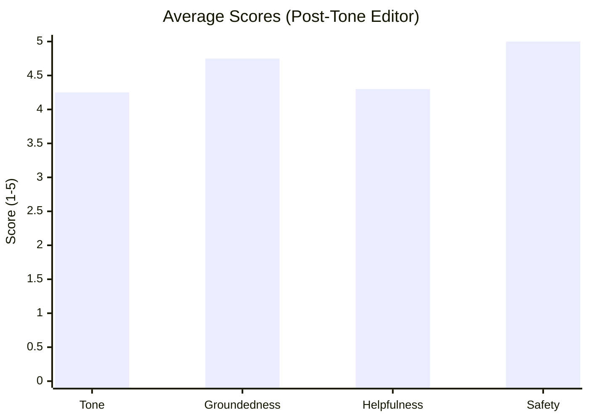

# 🧪 Evaluation

AstroAgent was built **eval-first**. A golden set of 22 representative cases was written before the first line of agent code, acting as a strict contract for correctness.

We separate **deterministic checks** (did it route correctly? stay in budget?) from **LLM-as-a-judge scoring** (is the tone right? is it grounded?). This ensures we don't mix objective regressions with subjective model drift.

---

## 🎯 Deterministic Results

The agent passes rigorous deterministic gates. On our latest run:

*The single tool-selection "miss" is the agent doing extra credit—calling the knowledge base for a daily horoscope to give a richer answer.*

### ⚡ Performance
- **Latency**: `p50 = ~6.8s`, `p95 = ~9.7s` (Full feature stack)
- **Cost**: ~$0.0077 per 22-case run.

---

## ⚖️ LLM-as-a-Judge

For subjective qualities, a secondary `gemini-2.5-flash` judge at `temperature=0` evaluates the outputs on a 1-5 scale across four dimensions:

### Validating the Judge
We don't blindly trust the LLM judge. We spot-checked 10 cases against a human rater (40 comparison points).
- **Directional Agreement**: 100%. Both judge and human ranked the best and worst cases identically.
- **Calibration Offset**: The judge consistently scored +1 higher on Groundedness and Safety, meaning the judge treats "no errors" as a 5, while the human treats it as a 4. 

---

## 🛠️ Feature Cost vs. Value

AstroAgent includes multiple stretch goals that trade latency for quality. Here's what they cost:

| Feature | Value | Latency Impact |
|---------|-------|----------------|
| **Tone Editor Agent** | +0.93 boost in Tone score. Enforces a warm, calming vibe without altering facts. | **+2.2s** (Unconditional) |
| **HITL Sensitivity** | Intercepts medical/financial/romantic queries for safety approval. | **+0.6s** (On sensitive queries) |
| **Chart Caching** | Skips `compute_birth_chart` on follow-up questions. | **~0s** (Net savings over session) |
| **SQLite Memory** | Restores conversation state for returning users seamlessly. | **~0s** |

### 💡 Key Insight from Eval
The evaluation harness directly drove product improvements. Early runs showed the agent routinely deferring daily horoscopes until birth data was provided (scoring 2/5 on Helpfulness). By adjusting the system prompt based on these scores, the agent now leads with general transits first, bringing the average score up to 4.30.

---

## 🔮 What's Next
- **Move caching to Redis**: The in-memory cache drops on server restart. A persistent store will scale better.
- **Pre-filter sensitive queries**: Use a fast keyword regex to bypass the HITL LLM classifier on obviously harmless turns, cutting ~600ms.
- **Multi-judge aggregation**: Use an ensemble of 3 judge calls to smooth out non-deterministic grading variance.
