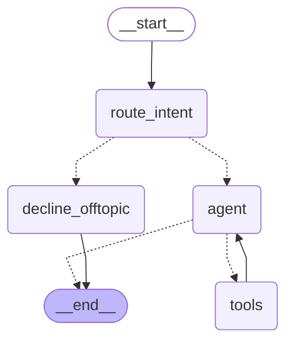

# AstroAgent

**An agentic astrology companion: LangGraph agent backend, streaming React frontend, and a validated eval harness.**

AstroAgent takes a birth date and place (time optional), a question about today's sky, or any astrology symbolism question — and a Gemini-powered agent decides which tools to call, calls them, and streams a reflective interpretation back. All insights are framed as symbolic self-inquiry; the system explicitly refuses medical, legal, and financial certainty. The project is eval-driven: a 22-case golden set and a one-command harness with deterministic checks and an LLM-as-judge layer were written alongside the features. See [EVALUATION.md](EVALUATION.md) for findings.

**What's where:** `backend/` — LangGraph + FastAPI · `frontend/` — React + TypeScript · `eval/` — golden set + runner + judge

---

## Architecture

**Flow: router classifies intent → off-topic short-circuits → everything else enters the agent ⇄ tools loop with a 6-call budget.**

The diagram below is generated from the compiled graph at runtime — not hand-drawn.



`route_intent` is a cheap structured-output call that classifies each message into one of five intents: `chart_request`, `daily_horoscope`, `freeform`, `offtopic`, or `adversarial`. Off-topic messages short-circuit to `decline_offtopic` — no tools, no main model. Everything else enters the `agent ⇄ tools` loop. Once six `ToolMessage`s accumulate, the agent switches to a tool-free model instance that must synthesise a final reply from what it already has.

**The four tools:**

| Tool | What it does | Key detail |
|---|---|---|
| `compute_birth_chart` | Natal chart for a date + place (time optional) via kerykeion offline mode | Results cached in a module-level dict; 1,366× speedup on cache hit |
| `geocode_place` | Resolves a place name → lat/lon + IANA timezone via Nominatim | Shared `_resolve_place` helper also used internally by `compute_birth_chart` |
| `get_daily_transits` | Current planetary positions at noon UTC (defaults to today); optionally maps transits to natal houses and lists aspect contacts | Five major aspects checked: conjunction ≤8°, sextile ≤5°, square ≤6°, trine ≤6°, opposition ≤8° |
| `knowledge_lookup` | Semantic search over a curated `notes.md` covering sign elements, all 12 houses, retrograde symbolism, and planetary archetypes; returns top-3 chunks | Embeddings via `gemini-embedding-001`; cosine similarity computed with numpy |

The **SSE stream** carries five typed JSON events: `token`, `intent`, `tool_start`, `tool_end` (truncated to 1,500 chars if large), and `done`. The frontend's expandable tool-trace is driven entirely by `tool_start`/`tool_end` pairs.

---

## Setup

**Requirements:** Python 3.13, Node.js 18+, a Google Gemini API key (free tier works).

### Backend

```bash
cd backend
uv sync                          # installs all dependencies from uv.lock
cp .env.example .env             # then fill in your GOOGLE_API_KEY
uv run uvicorn app.main:app --reload --port 8000
```

Endpoints: `GET /health` · `POST /chat` (SSE).

### Frontend

```bash
cd frontend
npm install
npm run dev
```

Open [http://localhost:5173](http://localhost:5173). If the dev server cannot reach the backend, set `VITE_API_URL=http://localhost:8000` in `frontend/.env`.

---

## Running the eval

```bash
cd backend
uv run python ../eval/runner.py              # deterministic checks only
uv run python ../eval/runner.py --judge      # add LLM-as-judge scoring
uv run python ../eval/runner.py --judge --spotcheck   # judge + 10-case human-validation set
uv run python ../eval/runner.py --limit 4    # quick re-check on N cases
```

Each run appends a row to `eval/results_log.csv`. For methodology and findings see [EVALUATION.md](EVALUATION.md).

---

## Tech choices

**kerykeion over flatlib:** flatlib is effectively unmaintained and incompatible with Pydantic v2. kerykeion (v5.12.9) is actively maintained, uses Pydantic 2 natively, and ships Swiss Ephemeris binaries via `pyswisseph` — all ephemeris calculations run offline after geocoding.

**Gemini (`gemini-2.0-flash`):** specified for the project. `langchain-google-genai` covers tool-binding and structured output. The same model serves as both intent router and main agent; `gemini-embedding-001` drives `knowledge_lookup`.

**LangGraph:** also specified. `StateGraph` with `ToolNode` and `tools_condition` handles the agent loop, budget guard, and streaming without custom orchestration.

---

## Known limitations

- **Chart cache is process-local.** The memoisation dict is in-memory, not shared across workers, and cleared on restart. A production deployment would use Redis or a persistent store.
- **Single-rater judge validation.** EV03 compared judge scores against one human rater (40 pairs, 100% within-1). One rater cannot resolve the systematic +1 offset the judge shows on groundedness and safety.
- **Selective-planet omission.** On some runs, sign-specific daily horoscope responses name only a subset of the ten returned planets. Known system-prompt gap, not a tool error.
- **kerykeion is AGPL-3.0.** Any distributed derivative must comply with AGPLv3. Review the license before deploying publicly or embedding in a commercial product.
