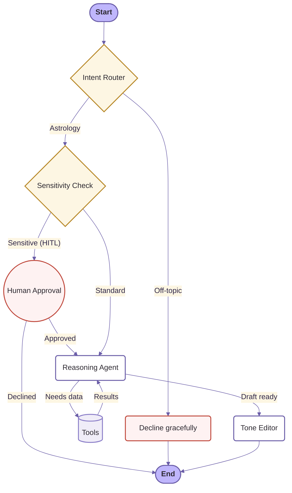

# ✦ AstroAgent

> **A daily spiritual companion, built with agentic AI.**

AstroAgent is a LangGraph-powered AI astrologer that computes your birth chart, reasons over real planetary data, and answers questions with warmth and care. It’s built to be a conversational guide—grounded in real astronomical math, not hallucination.

---

## 🔮 How It Works

AstroAgent uses a stateful agent graph to route requests, execute tools, and ensure responses are safe, accurate, and perfectly toned.



### ✨ Features
- **Deterministic Math**: Calculates planetary positions accurately offline using `kerykeion` (Swiss Ephemeris).
- **RAG Knowledge Base**: Semantically searches curated astrology notes to stay grounded.
- **Human-in-the-Loop (HITL)**: Automatically detects sensitive topics (health, finance, romance) and pauses for user approval before offering readings.
- **Tone Editor**: A final LLM pass that re-writes the response for a warm, calming, spiritual tone without altering factual astrology.
- **Cross-Session Memory**: SQLite persistence remembers your birth details and previous readings.

---

## 🚀 Quickstart

**Requirements**: Python 3.13, Node.js 18+, a Google Gemini API Key.

### 1. Start the Backend
```bash
cd backend
uv sync
cp .env.example .env  # Add your GOOGLE_API_KEY
uv run uvicorn app.main:app --reload --port 8000
```

### 2. Start the Frontend
```bash
cd frontend
npm install
npm run dev
```
Open [http://localhost:5173](http://localhost:5173) and start exploring!

---

## 📊 Evaluation
AstroAgent is built on a rigorous, eval-driven approach. 
Check out [EVALUATION.md](EVALUATION.md) to see how we track correctness, latency, and cost using a 22-case golden dataset and an LLM-as-a-judge harness.
