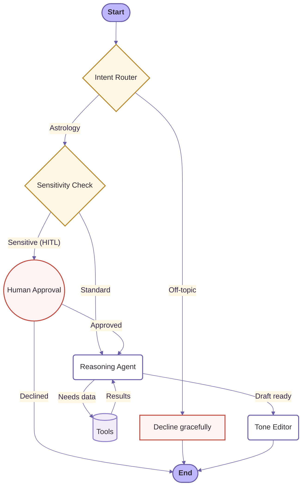

# ✦ AstroAgent

> **A daily spiritual companion, built with agentic AI.**

AstroAgent is a LangGraph-powered AI astrologer that computes your birth chart, reasons over real planetary data, and answers questions with warmth and care. It’s built to be a conversational guide—grounded in real astronomical math, not hallucination.

---

## 🔮 How It Works

AstroAgent uses a stateful agent graph to route requests, execute tools, and ensure responses are safe, accurate, and perfectly toned.



### ✨ Features
- **Deterministic Math**: Calculates planetary positions accurately offline using `kerykeion` (Swiss Ephemeris).
- **RAG Knowledge Base**: Semantically searches curated astrology notes to stay grounded.
- **Human-in-the-Loop (HITL)**: Automatically detects sensitive topics (health, finance, romance) and pauses for user approval before offering readings.
- **Tone Editor**: A final LLM pass that re-writes the response for a warm, calming, spiritual tone without altering factual astrology.
- **Cross-Session Memory**: SQLite persistence remembers your birth details and previous readings.

---

## 🚀 Quickstart

**Requirements**: Python 3.13, Node.js 18+, a Google Gemini API Key.

### 1. Start the Backend
```bash
cd backend
uv sync
cp .env.example .env  # Add your GOOGLE_API_KEY
uv run uvicorn app.main:app --reload --port 8000
```

### 2. Start the Frontend
```bash
cd frontend
npm install
npm run dev
```
Open [http://localhost:5173](http://localhost:5173) and start exploring!

---

## 📊 Evaluation
AstroAgent is built on a rigorous, eval-driven approach.
Check out [EVALUATION.md](EVALUATION.md) to see how we track correctness, latency, and cost using a 22-case golden dataset and an LLM-as-a-judge harness.

---

## ⚠️ Limitations

**Licensing.** `kerykeion`, the ephemeris library used for all planetary calculations, is licensed under AGPL-3.0. Any deployment that exposes the backend over a network must comply with AGPL-3.0 copyleft terms, including making the full source available to users.

**Chart cache is in-memory.** The natal chart computed for a session is stored in LangGraph graph state (SQLite-checkpointed per thread). This survives browser reloads within the same thread ID but drops if the server restarts. After a restart, the next chart request re-computes from scratch automatically.

**Mid-conversation birth detail changes are not auto-detected.** If you update your birth details via the form after a chart has already been computed in a session, the cached chart is reused for the remainder of that conversation. Starting a fresh conversation (Clear button) always begins from a clean state.

**HITL approved path is bounded by design.** When a user approves a sensitive reading (health, finances, relationships), the agent provides a symbolic, reflective interpretation — it will never give predictions, diagnoses, prognoses, or yes/no certainty answers, even on the approved path. Questions demanding that kind of certainty are declined regardless of approval status.

**LLM judge is single-rater, and not fully deterministic.** Qualitative scores (Tone, Groundedness, Helpfulness, Safety) come from a single `gemini-2.5-flash` judge call per case at `temperature=0`. Even at temperature 0, Gemini's structured-output path varies by about ±1 on individual cases across runs (notably Groundedness on daily-transit cases), so all reported numbers come from a single committed run rather than an average. Validated against a human rater on 10 cases (40 points): overall MAE 0.28, 29/40 exact, 38/40 within 1 point — the judge tracks the human closely on Safety and Groundedness and runs slightly generous on Helpfulness for incomplete-but-honest answers. Reliable for detecting regressions between runs; multi-judge median aggregation is planned to reduce the variance.

**Latency is ~14 s p50 under the full feature stack.** The tone editor and sensitivity classifier each add a full LLM pass to most turns — measured at +2.2 s and +0.4–0.6 s respectively, before the model upgrade to Gemini 2.5 Flash added further overhead. Conditional execution (skip editor for short responses, regex pre-filter before the sensitivity LLM call) is the planned optimisation; see EVALUATION.md for the detailed breakdown.

**Tool surface.** The agent has access to exactly four tools:

| Tool | Purpose |
|---|---|
| `compute_birth_chart` | Computes a natal chart from birth date, optional time, and place (offline, via kerykeion) |
| `get_daily_transits` | Retrieves current planetary positions for a given date (defaults to today) |
| `geocode_place` | Resolves a place name to latitude, longitude, and IANA timezone |
| `knowledge_lookup` | Searches curated astrology reference notes for symbolic meaning |

It has no access to the internet, user files, or any system outside these four tools and the SQLite checkpoint store.